## 2024-12-19 (成功率: 4/17)

1. 涨停不放量的股票第二天回避，参考 **失败案例**
2. 突破平台不放量第二天大幅高开的可以试错，参考 **中材节能**
3. 底部倍量换手，第二天大幅低开可以买入，参考 **佳力图**
4. 底部连续多日高换手并涨停，第二天高开买入，参考 **兆易创新**
5. 地天板股票，第二天回避，参考 **博瑞传媒**

### 成功案例
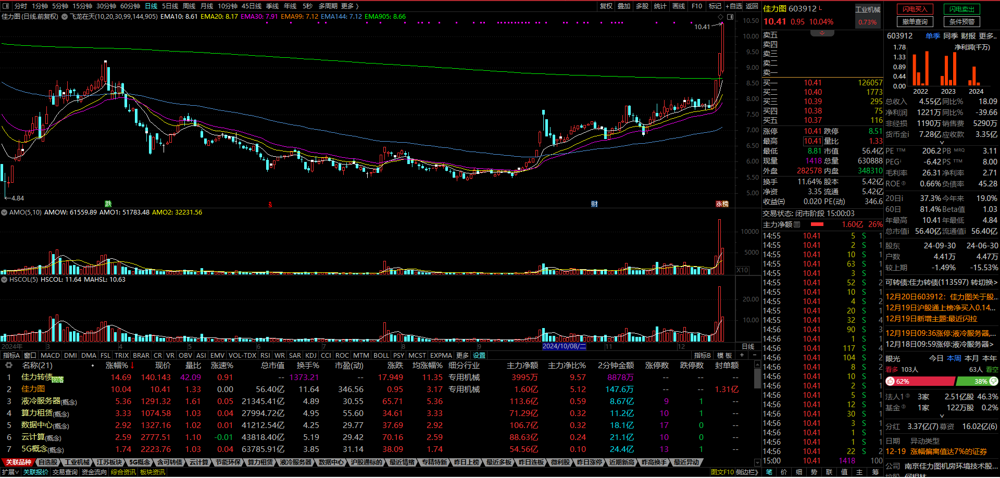
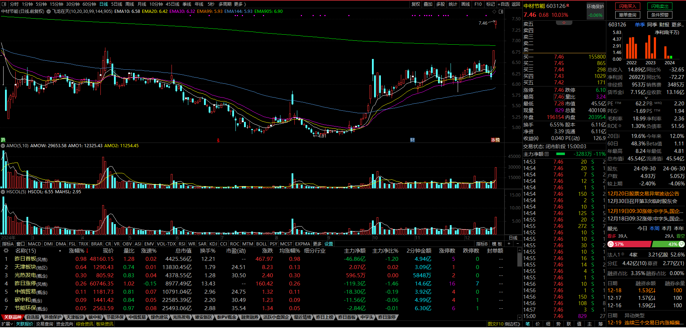
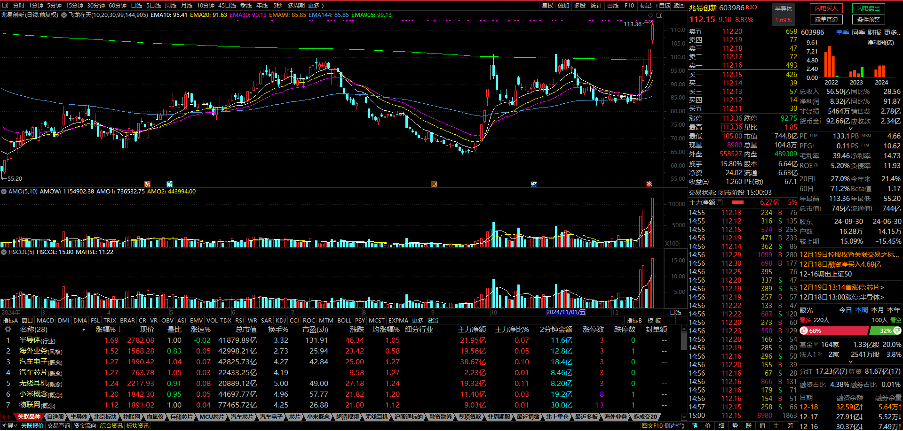
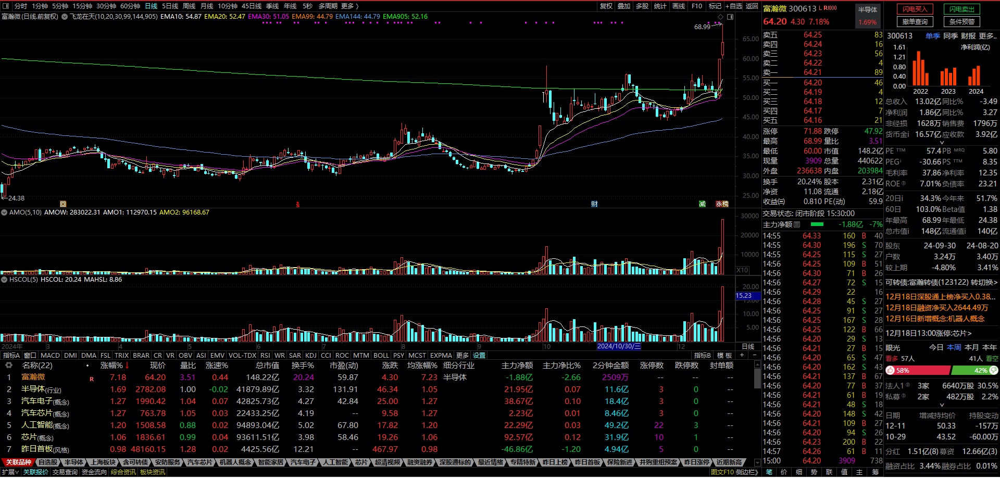

### 失败案例
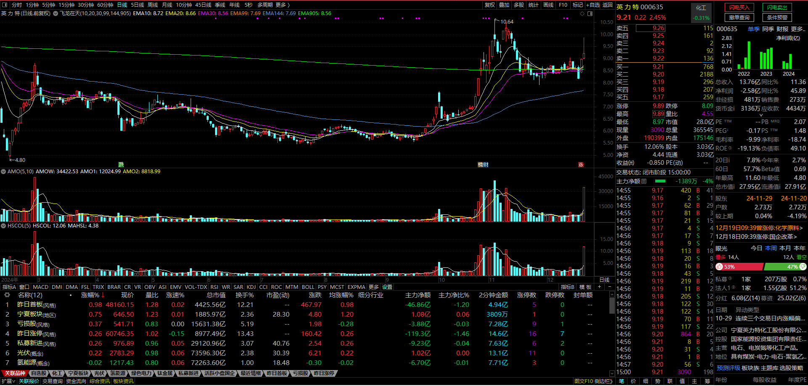
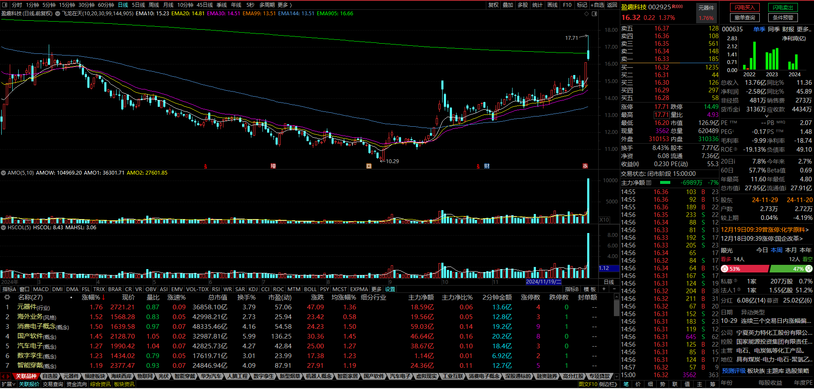
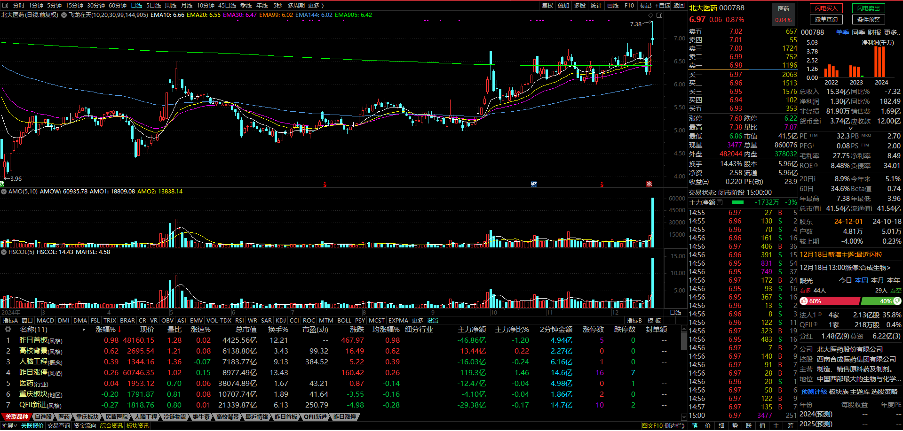
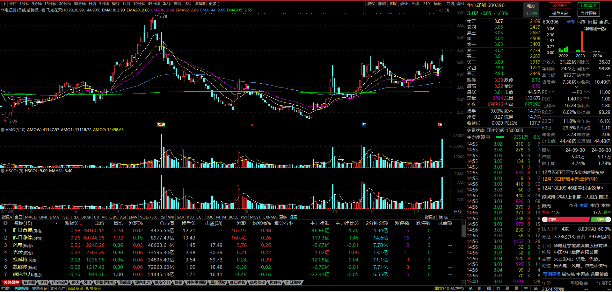
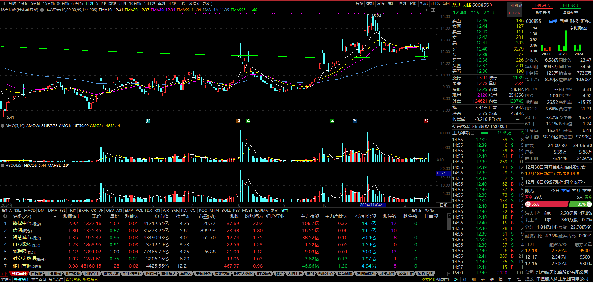
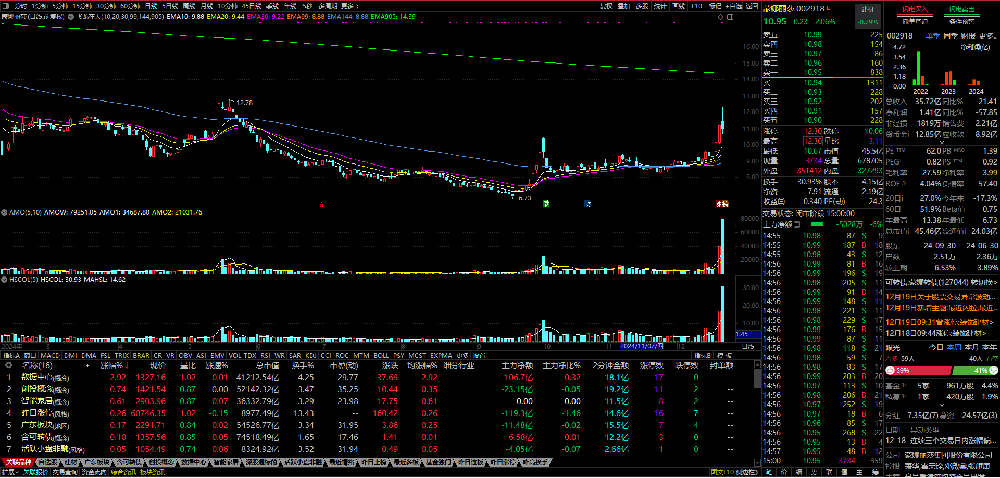
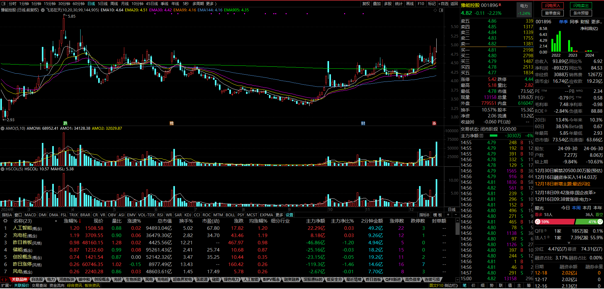
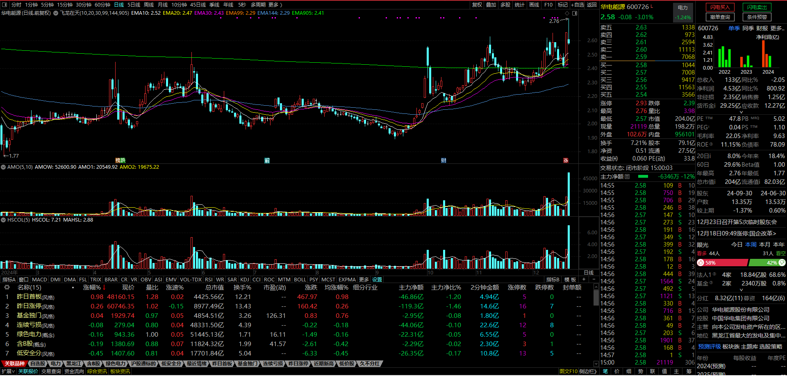
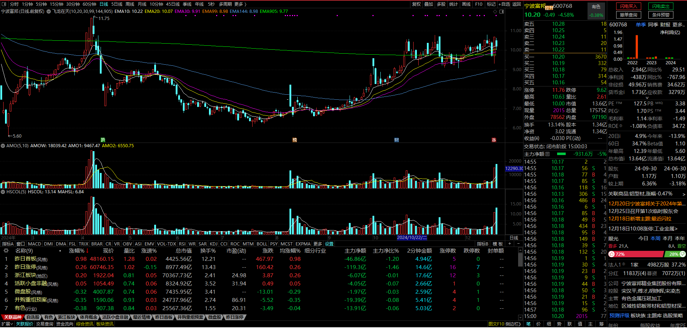
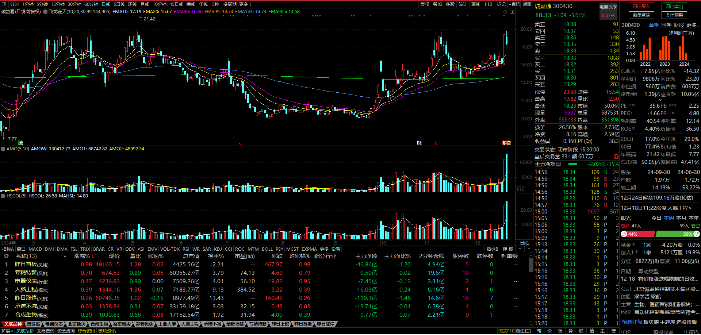
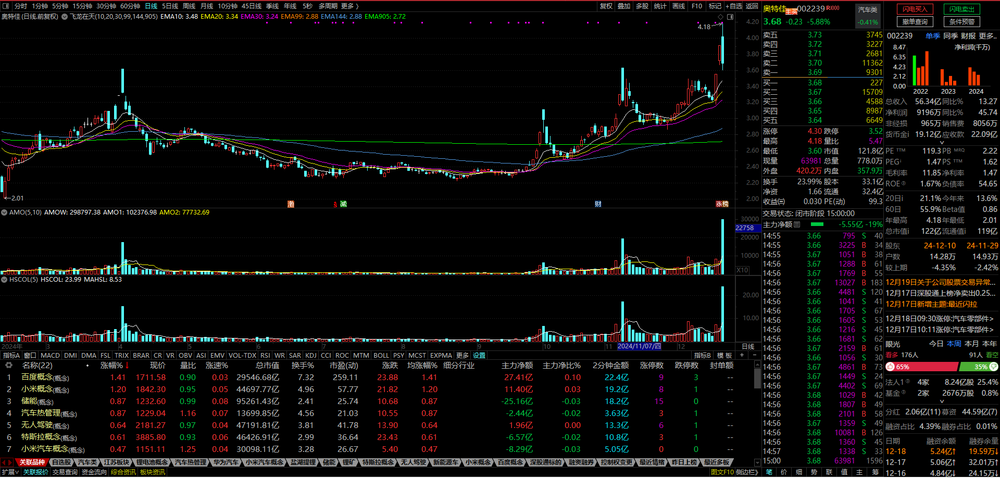
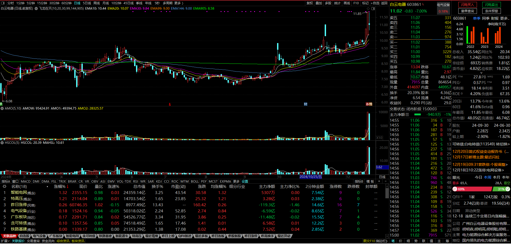
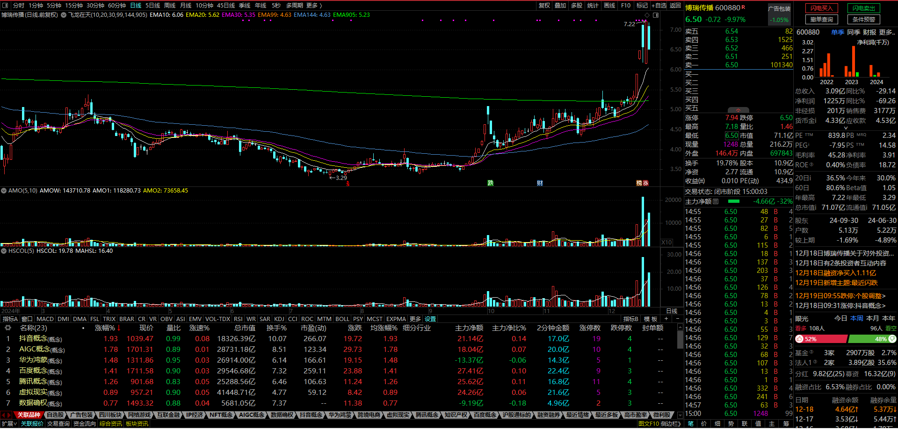